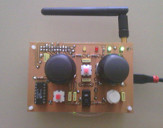

DroneWifi
=========

Ce projet a pour but de créer une télécommande matérielle pour piloter l'AR.drone 2.0 de Parrot. Ce quadricopter commercial se commande normalement grâce à une application ordiphone par WiFi.
Il a été réalisé par Baudouin Feildel ([@AMDG2](https://github.com/AMDG2/)) et Thibaut Marty ([@ThibautMarty](https://github.com/ThibautMarty/)) dans le cadre du projet de 2e année de DUT Génie Électrique et Informatique Industrielle de 90 heures à l'IUT d'Angers.

Description des dossiers sources
--------------------------------

- **carte** : Contient le schéma de la carte électronique
- **bibliographie** : Contient les documentations utilisées
- **documents** : Contient divers documents (journal de bord du projet, diagramme de Gantt)
- **sources** : Contient toutes les sources
- **doxygen** : Contient la documentation des sources (documentation html générée avec Doxygen)

Licence
-------

Le projet est sous licence GPL v3 (voir le fichier LICENSE).
